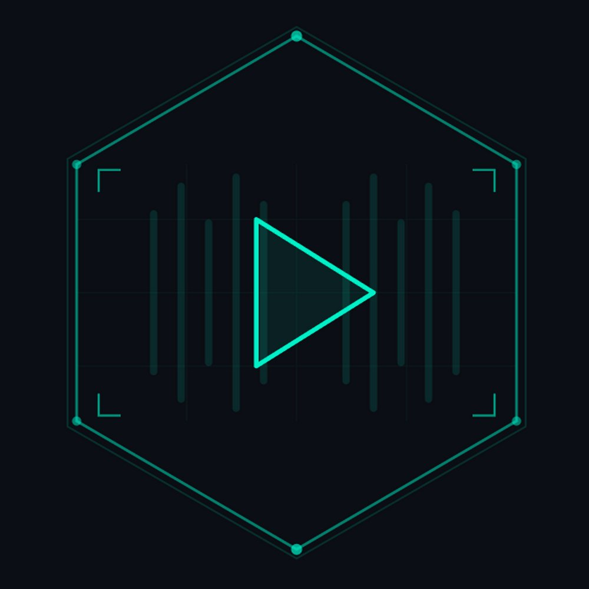

# ⬡ CyberPlayer

> **A cyberpunk terminal-style music player for Android**

<p align="center">
  
</p>

<p align="center">
  
  
  
  
</p>

---

CyberPlayer is an offline music player built with Flutter, designed with a **retro-futuristic cyberpunk terminal aesthetic**. It scans your device's local music files and provides a full-featured playback experience — complete with animated visualizer, blurred album art backgrounds, notification media controls, and a neon-drenched interface.

---

## ✨ Features

### 🎵 Audio Playback
- Full queue management with `ConcatenatingAudioSource` for gapless playback
- Shuffle and repeat modes (off / all / one)
- Background playback — music keeps playing when the app is minimized
- Media notification with **album art, prev/pause/next controls, and seek bar**
- Album artwork extracted from MP3 metadata and displayed per-track in notifications

### 🖥 Cyberpunk Terminal UI
- Dark theme with **neon cyan, pink, and purple** accent colors
- **JetBrains Mono** monospace font throughout
- Animated boot sequence on startup
- Scanline overlay effect for retro CRT feel
- Animated bar visualizer on the now-playing screen
- **Blurred album art** as background on the player screen

### 📁 Library Management
- Automatic scan of all audio files via Android MediaStore
- Browse by **folders**, **albums**, or **artists**
- Full-text search across title, artist, and album
- Configurable **root folder** to limit scan scope
- Manual rescan from settings

### 📋 Playlists
- Create, delete, and manage custom playlists
- Add songs via long-press context menu
- Persistent storage using SharedPreferences

### 🎨 Now Playing Screen
- Album artwork with animated visualizer overlay
- Blurred album art background with gradient overlay
- Full transport controls: shuffle, previous, play/pause, next, repeat
- Seek bar with elapsed/total time display
- Queue position indicator

### 🔔 Notification Controls
- Persistent media notification while playing
- Album art thumbnail per track
- Previous / Pause / Next buttons
- Seek bar with progress
- Powered by `just_audio_background` + `audio_service`

---

## 📸 Screenshots

| Boot Screen | Library | Now Playing | Notification |
|:-----------:|:-------:|:-----------:|:------------:|
| Terminal boot animation | Folder/Album/Artist browsing | Blurred art + visualizer | Media controls + artwork |

---

## 🏗 Architecture

```
lib/
├── main.dart                        # Entry point, boot screen
├── theme/
│   └── cyber_theme.dart             # Full cyberpunk theme system
├── models/
│   └── song.dart                    # Song & Playlist data models
├── services/
│   ├── audio_player_service.dart    # just_audio + ConcatenatingAudioSource
│   ├── music_scanner.dart           # on_audio_query MediaStore scanner
│   └── playlist_service.dart        # SharedPreferences persistence
├── providers/
│   └── music_provider.dart          # Central ChangeNotifier state
├── screens/
│   ├── app_shell.dart               # 3-tab scaffold (Library/Playlists/Config)
│   ├── home_screen.dart             # Folders/Albums/Artists + search
│   ├── playlists_screen.dart        # Playlist management
│   ├── settings_screen.dart         # Root folder selector + rescan
│   └── now_playing_screen.dart      # Full player with visualizer
└── widgets/
    ├── mini_player.dart             # Bottom bar with controls + artwork
    ├── song_tile.dart               # Tappable song row (full-row tap)
    └── cyber_widgets.dart           # ScanlineOverlay, CyberDivider
```

---

## 🔧 Tech Stack

| Component | Technology |
|-----------|-----------|
| Framework | Flutter 3.x |
| State Management | Provider + ChangeNotifier |
| Audio Playback | `just_audio` with `ConcatenatingAudioSource` |
| Notification Controls | `just_audio_background` + `audio_service` |
| Media Scanning | `on_audio_query` (Android MediaStore) |
| Permissions | `permission_handler` |
| Audio Focus | `audio_session` |
| Stream Combining | `rxdart` |
| Persistence | `shared_preferences` |
| Font | JetBrains Mono |

---

## 📦 Dependencies

```yaml
dependencies:
  flutter: sdk
  provider: ^6.1.1
  just_audio: ^0.9.42
  just_audio_background: ^0.0.1-beta.13
  audio_service: ^0.18.15
  on_audio_query: ^2.9.0
  permission_handler: ^11.3.1
  shared_preferences: ^2.3.3
  rxdart: ^0.28.0
  audio_session: ^0.1.21
```

---

## 🚀 Getting Started

### Prerequisites

- Flutter SDK 3.x+
- Android SDK with `compileSdk 36`
- Java 17 (required by AGP 8.7.3)
- An Android device or emulator running Android 7.0+ (API 24+)

### Installation

```bash
# Clone the repository
git clone https://github.com/yourusername/cyberplayer.git
cd cyberplayer

# Install dependencies
flutter pub get

# Add JetBrains Mono fonts (optional but recommended)
# Place these files in assets/fonts/:
#   - JetBrainsMono-Regular.ttf
#   - JetBrainsMono-Bold.ttf
#   - JetBrainsMono-Light.ttf

# Run on connected device
flutter run

# Build release APK
flutter build apk --release
```

### First Launch

1. Grant **storage permission** when prompted
2. CyberPlayer scans your device's audio files automatically
3. Browse by folder, album, or artist
4. Tap any song to start playback
5. Swipe up from the mini-player to open the full now-playing screen

---

## ⚙️ Configuration

### Root Folder

Limit which folder CyberPlayer scans:

1. Go to the **CONFIG** tab (gear icon)
2. Tap **SELECT ROOT FOLDER**
3. Choose a folder — only songs within it will appear
4. Tap **CLEAR** to scan all folders again

### Fonts

CyberPlayer uses JetBrains Mono for the terminal aesthetic. Download it from [JetBrains](https://www.jetbrains.com/mono/) and place the `.ttf` files in `assets/fonts/`. The app works without them but falls back to the system monospace font.

---

## 🏗 Build Configuration

| Setting | Value |
|---------|-------|
| `compileSdk` | 36 |
| `targetSdk` | 36 |
| `minSdk` | 24 (Android 7.0) |
| AGP | 8.7.3 |
| Kotlin | 2.1.0 |
| Gradle | 8.11.1 |
| Java | 17 |

### Key Android Config

**`MainActivity.kt`** — Uses `AudioServiceActivity` for notification integration:
```kotlin
package com.cyberplayer.app
import com.ryanheise.audioservice.AudioServiceActivity
class MainActivity: AudioServiceActivity()
```

**`main.dart`** — `JustAudioBackground.init()` must be called **outside** `runZonedGuarded`:
```dart
Future<void> main() async {
  WidgetsFlutterBinding.ensureInitialized();
  await JustAudioBackground.init(
    androidNotificationChannelId: 'com.cyberplayer.audio',
    androidNotificationChannelName: 'CyberPlayer',
  );
  runApp(const CyberPlayerApp());
}
```

---

## 🐛 Troubleshooting

### Build fails with Gradle lock errors (Windows)
```powershell
.\android\gradlew.bat --stop
taskkill /F /IM java.exe
Remove-Item -Recurse -Force .\android\.gradle\, .\build\
flutter clean
flutter pub get
flutter run
```

### "different roots: C:\ and G:\" warnings
Harmless — caused by Pub cache on `C:\` and project on `G:\`. Build still succeeds.

### `on_audio_query` deprecated Playlists warnings
Harmless — the plugin uses deprecated MediaStore Playlists API internally. Doesn't affect functionality.

### No music found
- Ensure music files are in a standard location (`/sdcard/Music/`, `/sdcard/Download/`, etc.)
- Try setting a root folder in CONFIG
- Tap **RESCAN** after adding new files
- On emulator, push files with: `adb push song.mp3 /sdcard/Music/`

### Notification artwork not updating
Album art is extracted from each MP3's embedded metadata using `on_audio_query`. Songs without embedded artwork will show no image. Use a tag editor like [Mp3tag](https://www.mp3tag.de/) to embed cover art.

---

## 📄 License

This project is licensed under the MIT License — see the [LICENSE](LICENSE) file for details.

---

## 🤝 Contributing

Contributions are welcome! Please feel free to submit a Pull Request.

1. Fork the project
2. Create your feature branch (`git checkout -b feature/AmazingFeature`)
3. Commit your changes (`git commit -m 'Add some AmazingFeature'`)
4. Push to the branch (`git push origin feature/AmazingFeature`)
5. Open a Pull Request

---

## 🙏 Acknowledgements

- [just_audio](https://pub.dev/packages/just_audio) — Powerful audio playback engine
- [on_audio_query](https://pub.dev/packages/on_audio_query) — Android MediaStore scanner
- [audio_service](https://pub.dev/packages/audio_service) — Background audio & notification controls
- [JetBrains Mono](https://www.jetbrains.com/mono/) — The perfect monospace font
- Inspired by retro-futuristic cyberpunk aesthetics

---

<p align="center">
  <strong>⬡ Built with neon and noise ⬡</strong>
</p>
